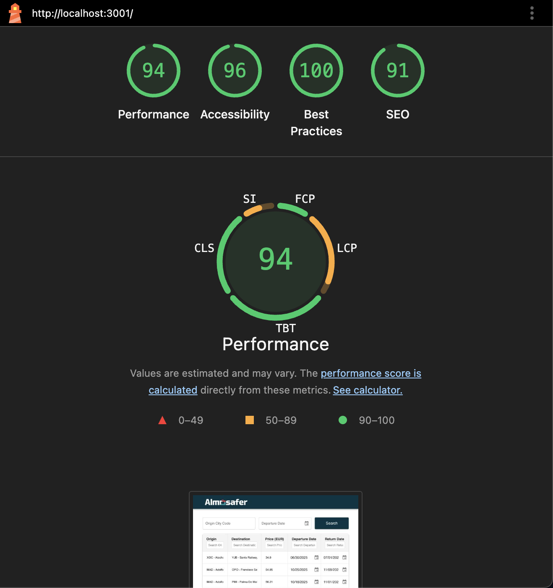
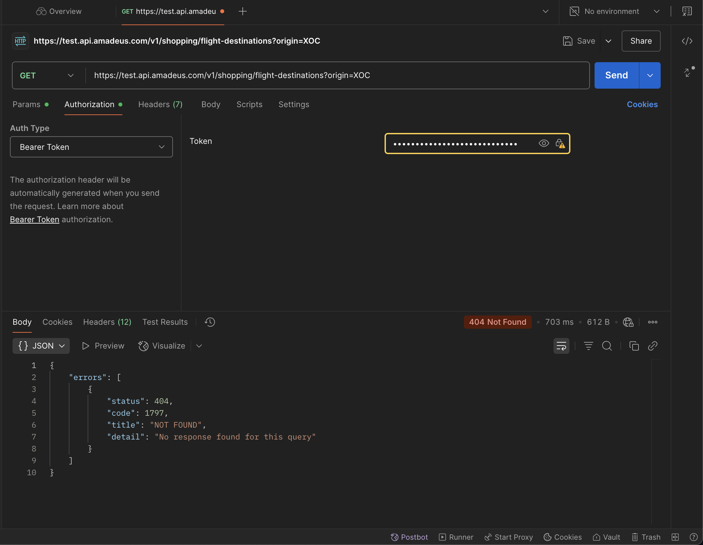
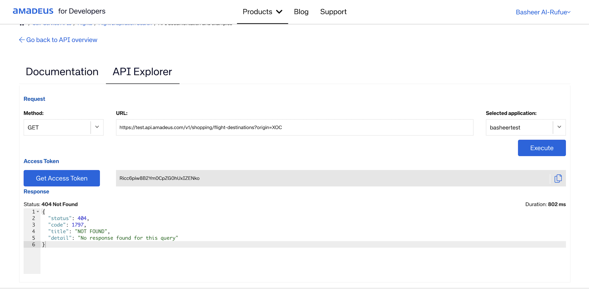

# Web Code Challenge — Flight Inspirations Admin Dashboard

This project was built as part of a technical task to demonstrate frontend integration skills, API usage, UI/UX enhancements.  
It is based on an existing codebase with editable table functionality using TanStack Table.

While implementing the flight search feature, I discovered that the /search endpoint consistently returned a 404 Not Found error for most cities except MAD (Madrid). This issue is documented with screenshots for reference, showing it occurred during development. A fallback and an error-handling mechanism has been implemented, but a fully functional multi-city demo may depend on backend/API resolution.

To ensure a realistic and reviewable implementation, I chose not to fully refactor the existing codebase. Instead, I worked within the current structure, making localized improvements where necessary. This approach helps maintain continuity with the existing code and demonstrates how real-world tasks are often completed in incremental steps.

## Features Implemented

- API integration with Amadeus Flight Inspiration Search
- Search form with inputs for origin city code and departure date
- Column filtering
- Editable table with cell-level editing and a save button to clear dirty state
- Client-level caching
- Drag-and-drop reordering of table columns
- Responsive layout for desktop and mobile
- Client-side pagination

## Running Locally

### 1. Clone the repository

```bash
git clone https://github.com/BasheerMazin/web-code-challenge.git
cd web-code-challenge
```

### 2. Install dependencies

```bash
npm install
```

### 3. Set up environment variables

Create a `.env.local` file in the root of the project and add the following:

```env
REACT_APP_API_KEY=your_amadeus_api_key
REACT_APP_API_SECRET=your_amadeus_api_secret
```

You can get your API credentials from https://developers.amadeus.com/register.

### 4. Start the development server

```bash
npm start
```

The app will be available at http://localhost:3000.

## Performance metrics



## 404 API Error



